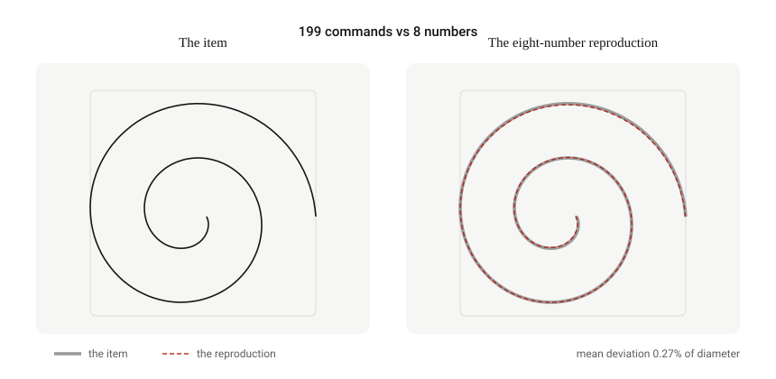
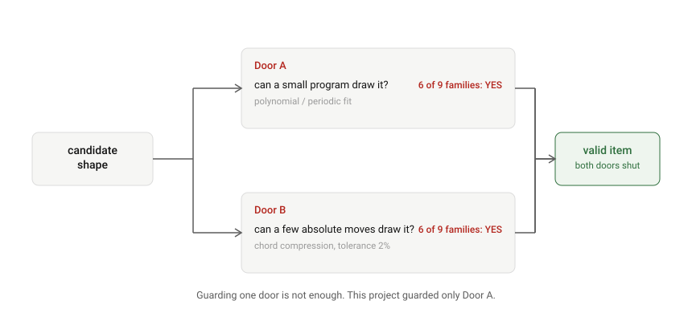
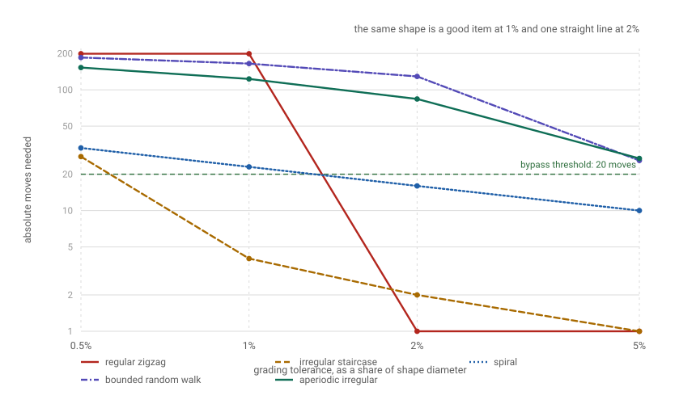
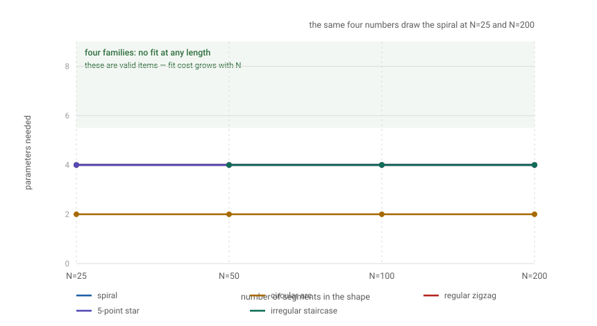
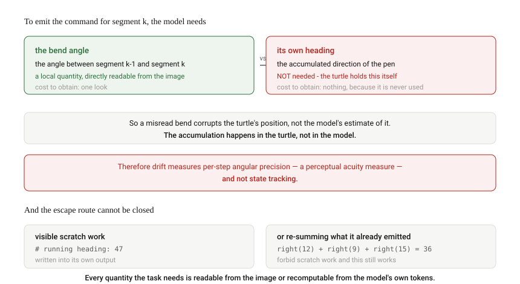
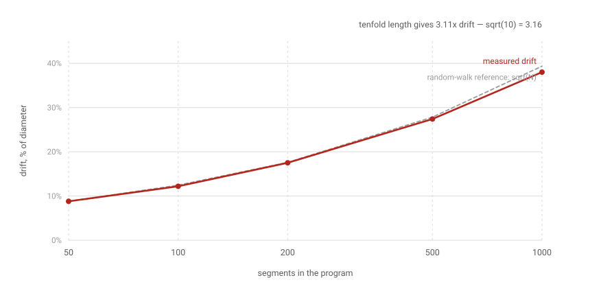
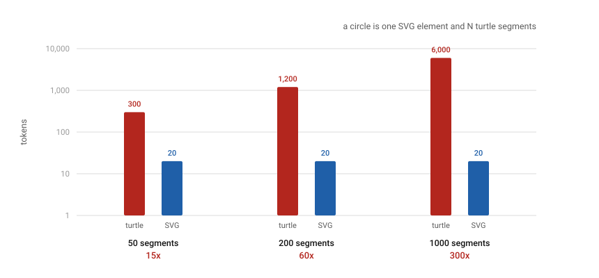

# Drape

### A negative result on Turtle Graphics as a visual-reasoning probe for language models

[](https://namandhakad712.github.io/drape/paper.html)
[](https://namandhakad712.github.io/drape/)
[](https://www.python.org/)
[](#reproducing-every-number)
[](LICENSE)

---

## What this is

We set out to test a specific idea. Frontier models read images and emit images or SVG. SVG is
*declarative* — a list of absolute coordinates. Turtle Graphics is *imperative* — a pen with a
position and a heading, where every command is interpreted against accumulated state. So, the
argument ran, forcing a model to reproduce an image through turtle commands rather than SVG
should force it to *hold* spatial state, and measuring how that state degrades should tell us
something about spatial reasoning.

We built the instrument, then tested the instrument. **It does not work, and we can show why.**

This repository is the complete record: the interpreter, every measurement script, every figure,
and a paper. It is a **negative result**, published because the analysis generalises and because
most attempts at this publish the version that looks good in a demo.

**No model was ever called.** This is an analysis of whether the experiment could work, not an
experiment on models. That is the point.

---

## Reading this work

This README is self-contained. The documentation site is the same material with every figure
rendered and cross-linked, and it is a faster read:

| Page | What is there |
|---|---|
| [**Overview**](https://namandhakad712.github.io/drape/) | the idea, the four findings, why the route is closed |
| [**Paper**](https://namandhakad712.github.io/drape/paper.html) | full write-up: abstract, method, results, threats to validity, references |
| [**Findings**](https://namandhakad712.github.io/drape/findings.html) | every result with its figure, its numbers, and its source file |
| [**Method**](https://namandhakad712.github.io/drape/method.html) | the five rules for testing whether a probe can work, as a checklist |
| [**Reproduce**](https://namandhakad712.github.io/drape/reproduce.html) | how to run everything, and what the floor check guards against |

---

## The headline result

A 199-command spiral — our flagship test item — is reproduced to **0.27% of its diameter by eight
numbers**.



The cheat is a loop with a counter:

```
forward(a0 + a1*u + a2*u^2 + a3*u^3)
right(  b0 + b1*u + b2*u^2 + b3*u^3)      where u runs from -1 to 1
```

Eight coefficients. The turn angle is very nearly constant and the step length is very nearly a
smooth function of position, so two low-order polynomials carry the entire shape. Nothing is
tracked. The mean deviation is a quarter of one percent.

That single number invalidates the item family the whole design was built on.

---

## The four findings

### 1. The items are degenerate

| | |
|---|---|
| The item | 199 individual turtle commands |
| The reproduction | 8 numbers |
| Mean deviation | **0.27%** of the shape's diameter |
| Coverage | **100%** — every part of each curve lies within 2% of the other |

See `analysis/degeneracy_sweep.py`.

### 2. Degeneracy has two doors, and only one is normally guarded

The first door is *a small program*. The second is **absolute moves**: read a landmark off the
image, `goto` it, repeat. Zero accumulated state, zero drift, correct by construction.



An item is only valid if it is expensive to draw **both** ways. We measured the cost of the second
door as the fewest straight-line chords that stay within tolerance of the true path — each chord
being one `goto`:

| Shape family | Segments | Cheapest state-free program | Params | Error | Hops |
|---|---|---|---|---|---|
| circular arc (analytic) | 199 | periodic, p=5 | 10 | **0.00%** | 8 |
| 5-point star (periodic) | 10 | periodic, p=4 | 8 | **0.00%** | 10 |
| regular zigzag (periodic) | 199 | periodic, p=12 | 24 | **0.00%** | **1** |
| spiral (analytic) | 199 | polynomial, d=3 | 8 | **0.27%** | 16 |
| irregular staircase | 200 | periodic, p=6 | 12 | **0.41%** | **2** |
| bounded random walk | 199 | polynomial, d=3 | 8 | 2.59% | 129 |
| sine wave (analytic) | 199 | polynomial, d=2 | 6 | 13.81% | 9 |
| aperiodic irregular | 199 | polynomial, d=3 | 8 | 28.99% | 84 |
| varying curvature (smooth) | 199 | polynomial, d=2 | 6 | 54.51% | 186 |

**Six of nine shape families are dead.** The two that look best in a demo — the spiral and the
circular arc — die most completely. A regular zigzag needs **one** absolute move.

### 3. Degeneracy is not a property of a shape

It is a property of **shape × grading tolerance × search class**, and all three are chosen by the
person doing the measuring.



| Shape family | 0.5% | 1% | 2% | 5% |
|---|---|---|---|---|
| spiral | 33 | 23 | 16 | 10 |
| sine wave | 21 | 13 | 9 | 6 |
| circular arc | 17 | 12 | 8 | 5 |
| 5-point star | 11 | 10 | 10 | 10 |
| **regular zigzag** | **199** | **199** | **1** | **1** |
| varying curvature | 199 | 192 | 186 | 179 |
| **irregular staircase** | **28** | **4** | **2** | **1** |
| bounded random walk | 185 | 165 | 129 | 26 |
| aperiodic irregular | 153 | 123 | 84 | 27 |

*Absolute moves needed to reproduce the shape, by grading tolerance.*

The zigzag is the clearest case. It looks like a hard, high-frequency, many-turn shape. At 1%
tolerance it needs 199 absolute moves and is a perfectly good item. At 2% it needs **one** — it is
a straight line to within the tolerance the grader accepts. Nothing about the shape changed.

**"Is this item degenerate?" has no answer.** The answerable question is "at this tolerance, under
this search class, is it?" — and both are chosen by the experimenter.

### 4. The test can only ever return a lower bound

Our fitter searches polynomial step and turn sequences to degree 3, and periodic sequences to
period 12. That is a small class, and the `varying curvature` row above escapes it while being an
obvious closed form — it was generated by `right(6 + 4*sin(2*pi*i/60)); forward(9)`.

So the verdict is always **"no cheap program found"**, never **"no cheap program exists"**. Widen
the class and more items die. Item validity rests on an assumption that cannot be proved, only
failed to be disproved.

The only threshold-free version is the **scaling test**: rather than ask whether a cheap program
can fit, ask how the required fit cost *scales* with the length of the shape.



**The same four numbers draw the spiral whether it has 25 segments or 200.** A shape whose fit cost
is constant in N has a *name*, and a model that recognises the name reproduces it exactly at any
length. The four families that never fit at any length are what valid items look like.

---

## Why the route cannot work

This is the finding that closes the experiment, and it is not fixable by choosing better shapes.



To draw segment *k*, a model needs the turn from segment *k−1* to segment *k*. That is the angle
between two adjacent pieces of the picture — a **local, directly readable** quantity. Look at the
image, see the bend, write `right(12)`.

The model does **not** need to know its own heading. The turtle's heading is ground truth and the
turtle maintains it. So a misread bend does not corrupt the model's estimate of anything — it
corrupts the *turtle's* position, downstream, because the turtle integrated the error.

**The accumulation happens in the turtle, not in the model.** The drift metric therefore measures
per-step angular precision — a perceptual acuity measure — and not state tracking.

A model is forced to know its own state in exactly three situations: closing a path back onto its
start, placing a later stroke relative to the start, or avoiding a stroke it already drew. In all
three it can escape by reading the target off the image and using `goto` — which brings back
finding 2.

And then the half that cannot be designed around. The model's output is text. It can write
`# running heading: 47` in the middle of the program and attend back over it at every subsequent
token. Forbid that — parse strictly, allow only turtle commands — and it can *still* recompute the
running total at every step by summing the turn numbers it has already emitted, because it can see
them.

> **There is no configuration of this task that forces the computation into a non-textual
> channel.** Every quantity the task requires is either readable locally from the image or
> recomputable by summing the model's own emitted tokens. That is a structural property of an
> architecture whose only output is text.

### What that leaves

The benchmark cannot answer *"do models think in images?"* That question is not reachable from the
outside, by this route or any other.

What it can answer is narrower and still worth asking:

> **Do models have a perceptual shortcut that beats a text-strategy baseline?**

If a model solves closed-loop relative-only items better than a text-only strategy could predict —
and better than its own performance on a matched non-spatial task of identical token cost — then
something perceptual is doing work. That is measurable and falsifiable. It is not AGI, and the gap
between those two framings is the whole distance between this being a paper and being a press
release.

---

## Supporting measurements

**Drift grows as √N, not linearly.** A random walk in position, so the square root of the step
count.



| segments | 50 | 100 | 200 | 500 | 1000 |
|---|---|---|---|---|---|
| drift, % of diameter | 8.8 | 12.2 | 17.5 | 27.4 | 38.0 |

Tenfold length gives 3.11× drift. √10 = 3.16. **Practical consequence:** to double the drift signal
you must **quadruple** the program length, so a length sweep buys signal very slowly.

**The turtle form is expensive.** A circle is one SVG element and N turtle segments.



| segments | turtle tokens | SVG tokens | ratio |
|---|---|---|---|
| 50 | 300 | 20 | 15× |
| 200 | 1,200 | 20 | 60× |
| 1000 | 6,000 | 20 | 300× |

---

## The method — what generalises

The negative result is specific to turtle graphics. This is not. Five rules for testing whether a
proposed capability probe can work at all, before spending anything on models:

1. **Two-door validity.** Test whether the item can be solved by a cheap program *and* by a small
   set of absolute actions. Guarding one door is not enough.
2. **Degeneracy is joint, not intrinsic.** Report it as a function of tolerance, or the threshold
   is the finding.
3. **Prefer scaling over thresholds.** "Does the required complexity grow with input length?" is
   robust to threshold choice. A single number at a single N is not.
4. **Floor-check the measurement.** Feed the exact known answer back through the full pipeline and
   assert it scores zero. See below.
5. **Ask what the item's quantities cost to obtain.** If every required quantity is locally
   readable or recomputable from the output, the item cannot isolate the mechanism it claims to.

### Why rule 4 matters

Four bugs were found in our own measurement code, and **all four made the conclusion look stronger
than it was**:

| Bug | Effect |
|---|---|
| Deriving kinematics from a path resampled to equal arc length | Forces every segment to the same length *by construction*. The step sequence was erased and the test was silently measuring turn angles only. |
| `heading -= turn` instead of `+=` in the integrator | Every "cheap program" was compared against a **mirror** of the target. Nearest-point metrics barely notice. |
| Alignment returned a centred shape, scored against an uncentred original | A constant translation error injected into every measurement. |
| Unseeded rotation search | Locks onto the wrong symmetry axis for symmetric shapes; reports a large error for an exact reproduction. |

The spiral's measured error was **3.03%** before these fixes and **0.27%** after — the headline was
understated by 11×. `analysis/run_all.py` now asserts the floor check on every run.

---

## Reproducing every number

**No dependencies. Python 3.10+. Standard library only. No network, no API keys.**

```bash
git clone https://github.com/namandhakad712/drape.git
cd drape
python analysis/run_all.py
```

That runs every analysis script into `results/`, then asserts the floor check — if the exact
program does not score `0.0000%`, it exits non-zero and tells you not to trust the numbers. It
takes about thirty seconds.

To regenerate the figures:

```bash
python analysis/make_figures.py     # writes docs/assets/figures/*.svg
```

All scripts use fixed seeds. Output is byte-identical across platforms and runs.

To validate the documentation site before publishing it:

```bash
python analysis/check_site.py               # links, anchors, tag balance, alt text
python analysis/check_site.py --selftest    # prove the checks can fail
```

The `--selftest` mode copies the site to a temporary directory, injects four faults, and asserts
that all four are reported — because a check that has never been observed to fail is not evidence.

### Verify it yourself

```bash
# the headline number: how many parameters reproduce the spiral?
python analysis/degeneracy_sweep.py
```

Look for the `TWO-SIDED ITEM VALIDITY TEST` table and the `FLOOR CHECK` section at the bottom.

---

## Repository layout

```
drape/                    the interpreter — the part of the work that is sound
  turtle.py                 parser + simulator. NEVER executes model output.
  __init__.py               what the analysis established, and what it did not

analysis/                 every number in this repository, from fixed seeds
  degeneracy_sweep.py       two-sided validity, scaling test, floor check   [main]
  make_figures.py           generates every figure as standalone SVG
  turtle_drift.py           drift and token cost against program length
  shape_degeneracy.py       the first, single-sided test (superseded)
  degeneracy_widget.py      figure data for the overlay
  degeneracy_svg.py         raw path data for the overlay
  spiral_demo.py            correct versus drifted spiral
  run_all.py                runs everything and asserts the floor check
  check_site.py             validates the docs/ site (--selftest proves it can fail)
  add_head_meta.py          idempotently adds favicon / canonical / OG tags to every page

results/                  captured output of the analysis, committed as evidence
docs/                     the GitHub Pages site
  index.html                overview
  paper.html                the full write-up
  findings.html             every result, visualised
  method.html               the five-rule framework
  reproduce.html            how to run everything
  assets/style.css          design system
  assets/favicon.svg        the mark
  assets/figures/*.svg      publication figures, generated
  .nojekyll                 stops Jekyll from processing the directory
```

`shape_degeneracy.py` is kept deliberately. It is the first, single-sided version of the test, and
its closing recommendation names "irregular staircases" as a valid item family — which the
two-sided test later showed is drawn by **two absolute hops**. It is the record of how the finding
was reached, including the mistake.

---

## The interpreter

`drape/turtle.py` parses a turtle program and replays it in our own simulator.

**Model output is never executed.** Programs are parsed against a whitelist of eight commands and
replayed by an interpreter that only ever does arithmetic:

```python
from drape.turtle import parse_program, simulate, to_source

program = """
forward(10)
right(90)
fd(5)
setheading(0)
"""

cmds, errors = parse_program(program, allow_absolute=True)
trace = simulate(cmds)

trace.segments          # [(x0, y0, x1, y1), ...]
trace.escape_hatch_used # True — setheading was used
trace.n_goto, trace.n_setheading
```

`allow_absolute=False` rejects `goto` and `setheading`, which is the condition that forces a model
to maintain its own state. Aliases (`fd`, `rt`, `pu`, `setpos`, …) normalise to canonical names.

One command per line. Semicolon-separated commands on a single line are rejected.

---

## Limitations

- **The fitter's search class is small** — polynomials to degree 3, periods to 12. Every "valid"
  verdict means "no cheap program *found*".
- **Hop counts are relative to a stated tolerance.**
- **Nine shape families is not a survey.** They span analytic, periodic and random; they are not
  sampled from a population.
- **No model was ever called.** Every cost figure is derived from token accounting, not measured
  spend.
- **The scaling test shares the blind spot of the fixed-tolerance test** — two families escape it
  while being obvious closed forms.

---

## What remains, unbuilt

- **Closed-loop items, relative commands only.** The only item design we can defend, because it is
  the only one where state knowledge is forced rather than optional.
- **The image-versus-description ablation.** Give a model the image, or a matched verbal
  description of the same shape, at identical token cost. If the image wins, something perceptual
  is doing work. This is the narrow question that survives.

---

## Citation

```bibtex
@software{dhakad2026drape,
  author  = {Dhakad, Naman},
  title   = {Drape: a negative result on Turtle Graphics as a visual-reasoning probe for language models},
  year    = {2026},
  version = {0.2.0},
  url     = {https://github.com/namandhakad712/drape},
  license = {MIT}
}
```

See [`CITATION.cff`](CITATION.cff) for machine-readable metadata.

---

## License

Code: **MIT** — see [`LICENSE`](LICENSE).
Text and figures: **CC BY 4.0**.
